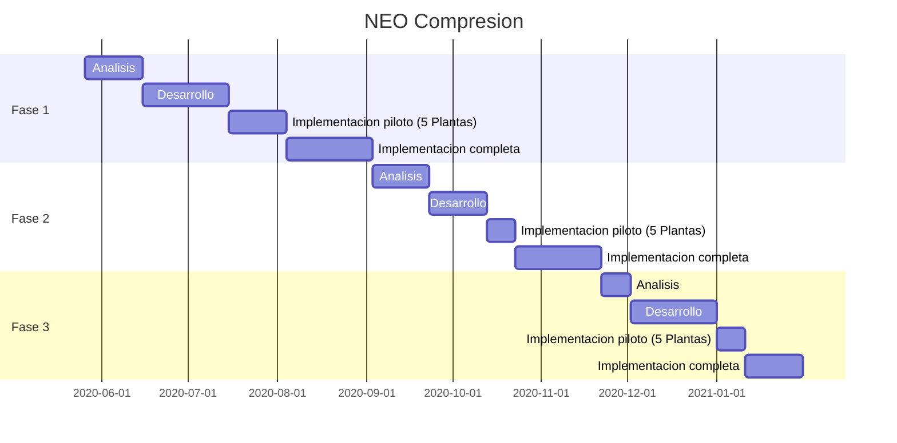

---

---

<h1 id="neo-compresion-neo-cp">NEO Compresion (NEO-CP)</h1>
<dl>
<dt>NEO</dt>
<dd>Notificacion de Eventos Operativos</dd>
</dl>
<h2 id="descripcion-de-fases-del-proyecto">Descripcion de fases del proyecto</h2>
<ul>
<li>
<h3 id="fase-1---carga-neo-cp-en-rosario-cog-neo-cp">Fase 1 - Carga NEO-CP en Rosario (COG-NEO-CP)</h3><ul>
<li>
	* Carga de parametros comunes a todos los clientes</li>
<li>Niveles de Carga y Control: Operador  -&gt;  Supervisor  -&gt;> COG.</li>
<li>
	* Reportes periodicos basicos</li>
</ul>
</li>
<li>
<h3 id="fase-2----carga-neo-cp-en-plantas-compresoras-hmi-neo-cp">Fase 2  - Carga NEO-CP en Plantas Compresoras (HMI-NEO-CP)</h3>
<ul>
<li>Carga de los partes diarios en el servidor de Telemetria local de cada Planta Compresora</li>
<li>Incorporacion de parametros propios de cada Cliente/Contrato</li>
<li>Sincronizacion periodica con COG-NEO-CP (NEO Rosario)</li>
</ul>
</li>
<li>
<h3 id="fase-3---integracion-telemetria-de-planta-compresora-cog-neo-cp">Fase 3 - Integracion Telemetria de Planta Compresora (COG-NEO-CP)</h3>
<ul>
<li>Integracion de principales variables con lectura automatica</li>
<li>Reglas de validacion de datos manuales y automaticos</li>
<li>Reportes de causas de carga manual</li>
</ul>
</li>
</ul>
<h2 id="cronograma-preliminar-de-ejecucion-del-pr

## Cronograma preliminar de ejecucion del proyecto

# Lenguajes de programacion y Herramientas de desarrollo previstas

## Back-end

### - Laravel
### - PHP

## Front-end

### Laravel

<!--stackedit_data:
eyJoaXN0b3J5IjpbMjA2NzIzMDAxOF19
-->