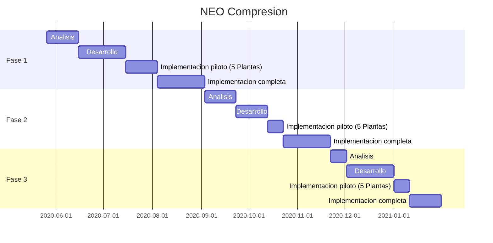

---

# NEO Compresion (NEO-CP)

## Descripcion de fases del proyecto

- ### Fase 1 - Carga NEO-CP en Rosario (COG-NEO-CP)Carga de parametros comunes a todos los clientesNiveles de Carga y Control: Operador  -  Supervisor  - COG.Reportes periodicos basicos

 - ### Fase 2  - Carga NEO-CP en Plantas Compresoras (HMI-NEO-CP)Carga de los partes diarios en el servidor de Telemetria local de cada Planta CompresoraIncorporacion de parametros propios de cada Cliente/ContratoSincronizacion periodica con COG-NEO-CP (NEO Rosario)
	
 - ### Fase 3 - Integracion Telemetria de Planta Compresora (COG-NEO-CP)
	 - Integracion de principales variables con lectura automaticaReglas de validacion de datos manuales y automaticos
	 - Reportes de causas de carga manual</li>
</ul>
</li>
</ul>
<h2 id="cronograma-preliminar-de-ejecucion-del-proyecto">Cronograma preliminar de ejecucion del proyecto</h2>
<h2 id="cronograma-preliminar-de-ejecucion-del-proyecto-1">Cronograma preliminar de ejecucion del proyecto</h2>

<svg xmlns="http://www.w3.org/2000/svg" id="mermaid-svg-1C0CderJSG1T2hDy" height="100%" viewBox="0 0 500 388"><g></g><g class="grid" transform="translate(75, 338)" fill="none" font-size="10" font-family="sans-serif" text-anchor="middle"><path class="domain" stroke="#000" d="M0.5,-303V0.5H350.5V-303"></path><g class="tick" opacity="1" transform="translate(8.5,0)"><line stroke="#000" y2="-303"></line><text fill="#000" y="3" dy="1em" style="text-anchor: middle;" stroke="none" font-size="10"> 20-06</text></g><g class="tick" opacity="1" transform="translate(50.5,0)"><line stroke="#000" y2="-303"></line><text fill="#000" y="3" dy="1em" style="text-anchor: middle;" stroke="none" font-size="10"> 20-07</text></g><g class="tick" opacity="1" transform="translate(94.5,0)"><line stroke="#000" y2="-303"></line><text fill="#000" y="3" dy="1em" style="text-anchor: middle;" stroke="none" font-size="10"> 20-08</text></g><g class="tick" opacity="1" transform="translate(137.5,0)"><line stroke="#000" y2="-303"></line><text fill="#000" y="3" dy="1em" style="text-anchor: middle;" stroke="none" font-size="10"> 20-09</text></g><g class="tick" opacity="1" transform="translate(179.5,0)"><line stroke="#000" y2="-303"></line><text fill="#000" y="3" dy="1em" style="text-anchor: middle;" stroke="none" font-size="10"> 20-10</text></g><g class="tick" opacity="1" transform="translate(223.5,0)"><line stroke="#000" y2="-303"></line><text fill="#000" y="3" dy="1em" style="text-anchor: middle;" stroke="none" font-size="10"> 20-11</text></g><g class="tick" opacity="1" transform="translate(265.5,0)"><line stroke="#000" y2="-303"></line><text fill="#000" y="3" dy="1em" style="text-anchor: middle;" stroke="none" font-size="10"> 20-12</text></g><g class="tick" opacity="1" transform="translate(308.5,0)"><line stroke="#000" y2="-303"></line><text fill="#000" y="3" dy="1em" style="text-anchor: middle;" stroke="none" font-size="10"> 21-01</text></g></g><g><rect x="0" y="48" width="462.5" height="24" class="section section0"></rect><rect x="0" y="72" width="462.5" height="24" class="section section0"></rect><rect x="0" y="96" width="462.5" height="24" class="section section0"></rect><rect x="0" y="120" width="462.5" height="24" class="section section0"></rect><rect x="0" y="144" width="462.5" height="24" class="section section1"></rect><rect x="0" y="168" width="462.5" height="24" class="section section1"></rect><rect x="0" y="192" width="462.5" height="24" class="section section1"></rect><rect x="0" y="216" width="462.5" height="24" class="section section1"></rect><rect x="0" y="240" width="462.5" height="24" class="section section2"></rect><rect x="0" y="264" width="462.5" height="24" class="section section2"></rect><rect x="0" y="288" width="462.5" height="24" class="section section2"></rect><rect x="0" y="312" width="462.5" height="24" class="section section2"></rect></g><g><rect rx="3" ry="3" x="75" y="50" width="28" height="20" class="task  task0"></rect><rect rx="3" ry="3" x="103" y="74" width="42" height="20" class="task  task0"></rect><rect rx="3" ry="3" x="145" y="98" width="28" height="20" class="task  task0"></rect><rect rx="3" ry="3" x="173" y="122" width="42" height="20" class="task  task0"></rect><rect rx="3" ry="3" x="215" y="146" width="28" height="20" class="task  task1"></rect><rect rx="3" ry="3" x="243" y="170" width="28" height="20" class="task  task1"></rect><rect rx="3" ry="3" x="271" y="194" width="14" height="20" class="task  task1"></rect><rect rx="3" ry="3" x="285" y="218" width="42" height="20" class="task  task1"></rect><rect rx="3" ry="3" x="327" y="242" width="14" height="20" class="task  task2"></rect><rect rx="3" ry="3" x="341" y="266" width="42" height="20" class="task  task2"></rect><rect rx="3" ry="3" x="383" y="290" width="14" height="20" class="task  task2"></rect><rect rx="3" ry="3" x="397" y="314" width="28" height="20" class="task  task2"></rect><text font-size="11" x="108" y="63.5" text-height="20" class="taskTextOutsideRight taskTextOutside0 ">Analisis           </text><text font-size="11" x="150" y="87.5" text-height="20" class="taskTextOutsideRight taskTextOutside0 ">Desarrollo         </text><text font-size="11" x="178" y="111.5" text-height="20" class="taskTextOutsideRight taskTextOutside0 ">Implementacion piloto (5 Plantas)     </text><text font-size="11" x="220" y="135.5" text-height="20" class="taskTextOutsideRight taskTextOutside0 ">Implementacion completa     </text><text font-size="11" x="248" y="159.5" text-height="20" class="taskTextOutsideRight taskTextOutside1 ">Analisis           </text><text font-size="11" x="276" y="183.5" text-height="20" class="taskTextOutsideRight taskTextOutside1 ">Desarrollo         </text><text font-size="11" x="290" y="207.5" text-height="20" class="taskTextOutsideRight taskTextOutside1 ">Implementacion piloto (5 Plantas)     </text><text font-size="11" x="332" y="231.5" text-height="20" class="taskTextOutsideRight taskTextOutside1 ">Implementacion completa     </text><text font-size="11" x="346" y="255.5" text-height="20" class="taskTextOutsideRight taskTextOutside2 ">Analisis           </text><text font-size="11" x="388" y="279.5" text-height="20" class="taskTextOutsideRight taskTextOutside2 ">Desarrollo         </text><text font-size="11" x="378" y="303.5" text-height="20" class="taskTextOutsideLeft taskTextOutside2 ">Implementacion piloto (5 Plantas)     </text><text font-size="11" x="392" y="327.5" text-height="20" class="taskTextOutsideLeft taskTextOutside2 ">Implementacion completa     </text></g><g><text x="10" y="98" class="sectionTitle sectionTitle0">Fase 1</text><text x="10" y="194" class="sectionTitle sectionTitle1">Fase 2</text><text x="10" y="290" class="sectionTitle sectionTitle2">Fase 3</text></g><g class="today"><line x1="65" x2="65" y1="25" y2="363" class="today"></line></g><text x="250" y="25" class="titleText">NEO Compresion</text></svg>

<h1 id="lenguajes-de-programacion-y-herramientas-de-desarrollo-previstas">Lenguajes de programacion y Herramientas de desarrollo previstas</h1>
<h2 id="back-end">Back-end</h2>
<h3 id="php">- PHP</h3>
<h3 id="laravel">- Laravel</h3>
<h2 id="front-end">Front-end</h2>
<h3 id="javascript">- Javascript</h3>
<h3 id="vue.js">- VUE.JS</h3>

## Cronograma preliminar de ejecucion del proyecto

## Cronograma preliminar de ejecucion del proyecto

# Lenguajes de programacion y Herramientas de desarrollo previstas

## Back-end

### - PHP
### - Laravel

## Front-end

### - Javascript
### - VUE.JS

<!--stackedit_data:
eyJoaXN0b3J5IjpbLTE3NjIxMTAxMjVdfQ==
-->