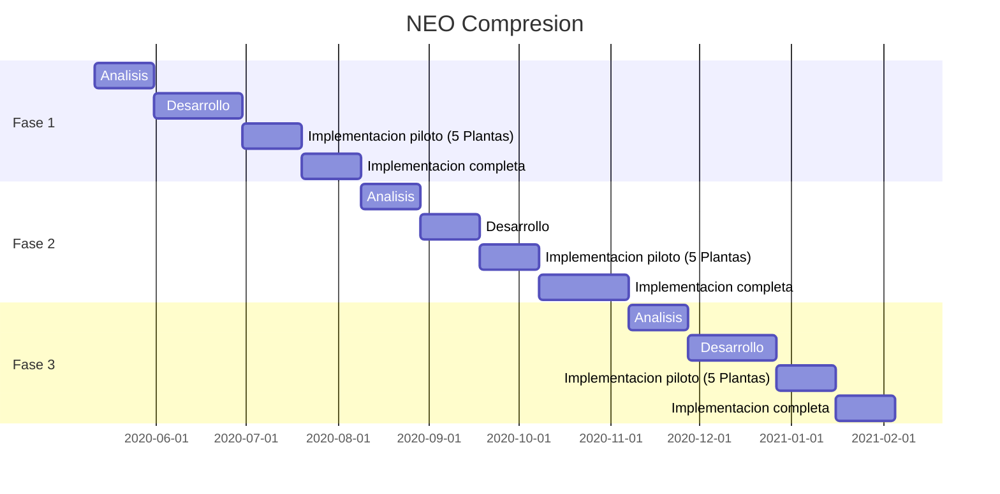

# NEO Compresion (NEO-CP)

NEO
:	Notificacion de Eventos Operativos
## Descripcion de fases del proyecto

- ### Fase 1 - Carga NEO-CP en Rosario (COG-NEO-CP)
	* Carga de parametros comunes a todos los clientes
	* Niveles de Carga y Control: Operador  ->  Supervisor  -> COG.
	* Reportes periodicos basicos

 - ### Fase 2  - Carga NEO-CP en Plantas Compresoras (HMI-NEO-CP)
	* Carga de los partes diarios en el servidor de Telemetria local de cada Planta Compresora
	* Incorporacion de parametros propios de cada Cliente/Contrato
	* Sincronizacion periodica con COG-NEO-CP (NEO Rosario)
	
 - ### Fase 3 - Integracion Telemetria de Planta Compresora (COG-NEO-CP)
	 - Integracion de principales variables con lectura automatica
	 - Reglas de validacion de datos manuales y automaticos
	 - Reportes de causas de carga manual

## Cronograma preliminar de ejecucion del proyecto

<svg xmlns="http://www.w3.org/2000/svg" id="mermaid-svg-1i3OrrSlsGEYRQxT" height="100%" viewBox="0 0 500 388"><g></g><g class="grid" transform="translate(75, 338)" fill="none" font-size="10" font-family="sans-serif" text-anchor="middle"><path class="domain" stroke="#000" d="M0.5,-303V0.5H350.5V-303"></path><g class="tick" opacity="1" transform="translate(31.5,0)"><line stroke="#000" y2="-303"></line><text fill="#000" y="3" dy="1em" stroke="none" font-size="10">2020-06-01</text></g><g class="tick" opacity="1" transform="translate(76.5,0)"><line stroke="#000" y2="-303"></line><text fill="#000" y="3" dy="1em" stroke="none" font-size="10">2020-07-01</text></g><g class="tick" opacity="1" transform="translate(122.5,0)"><line stroke="#000" y2="-303"></line><text fill="#000" y="3" dy="1em" stroke="none" font-size="10">2020-08-01</text></g><g class="tick" opacity="1" transform="translate(168.5,0)"><line stroke="#000" y2="-303"></line><text fill="#000" y="3" dy="1em" stroke="none" font-size="10">2020-09-01</text></g><g class="tick" opacity="1" transform="translate(213.5,0)"><line stroke="#000" y2="-303"></line><text fill="#000" y="3" dy="1em" stroke="none" font-size="10">2020-10-01</text></g><g class="tick" opacity="1" transform="translate(259.5,0)"><line stroke="#000" y2="-303"></line><text fill="#000" y="3" dy="1em" stroke="none" font-size="10">2020-11-01</text></g><g class="tick" opacity="1" transform="translate(304.5,0)"><line stroke="#000" y2="-303"></line><text fill="#000" y="3" dy="1em" stroke="none" font-size="10">2020-12-01</text></g><g class="tick" opacity="1" transform="translate(350.5,0)"><line stroke="#000" y2="-303"></line><text fill="#000" y="3" dy="1em" stroke="none" font-size="10">2021-01-01</text></g></g><g><rect x="0" y="48" width="462.5" height="24" class="section section0"></rect><rect x="0" y="72" width="462.5" height="24" class="section section0"></rect><rect x="0" y="96" width="462.5" height="24" class="section section0"></rect><rect x="0" y="120" width="462.5" height="24" class="section section0"></rect><rect x="0" y="144" width="462.5" height="24" class="section section1"></rect><rect x="0" y="168" width="462.5" height="24" class="section section1"></rect><rect x="0" y="192" width="462.5" height="24" class="section section1"></rect><rect x="0" y="216" width="462.5" height="24" class="section section1"></rect><rect x="0" y="240" width="462.5" height="24" class="section section2"></rect><rect x="0" y="264" width="462.5" height="24" class="section section2"></rect><rect x="0" y="288" width="462.5" height="24" class="section section2"></rect><rect x="0" y="312" width="462.5" height="24" class="section section2"></rect></g><g><rect rx="3" ry="3" x="75" y="50" width="30" height="20" class="task  task0"></rect><rect rx="3" ry="3" x="105" y="74" width="44" height="20" class="task  task0"></rect><rect rx="3" ry="3" x="149" y="98" width="30" height="20" class="task  task0"></rect><rect rx="3" ry="3" x="179" y="122" width="45" height="20" class="task  task0"></rect><rect rx="3" ry="3" x="224" y="146" width="22" height="20" class="task  task1"></rect><rect rx="3" ry="3" x="246" y="170" width="30" height="20" class="task  task1"></rect><rect rx="3" ry="3" x="276" y="194" width="15" height="20" class="task  task1"></rect><rect rx="3" ry="3" x="291" y="218" width="30" height="20" class="task  task1"></rect><rect rx="3" ry="3" x="321" y="242" width="15" height="20" class="task  task2"></rect><rect rx="3" ry="3" x="336" y="266" width="44" height="20" class="task  task2"></rect><rect rx="3" ry="3" x="380" y="290" width="15" height="20" class="task  task2"></rect><rect rx="3" ry="3" x="395" y="314" width="30" height="20" class="task  task2"></rect><text font-size="11" x="110" y="63.5" class="taskTextOutsideRight taskTextOutside0 ">Analisis           </text><text font-size="11" x="154" y="87.5" class="taskTextOutsideRight taskTextOutside0 ">Desarrollo         </text><text font-size="11" x="184" y="111.5" class="taskTextOutsideRight taskTextOutside0 ">Implementacion piloto (5 Plantas)     </text><text font-size="11" x="229" y="135.5" class="taskTextOutsideRight taskTextOutside0 ">Implementacion completa     </text><text font-size="11" x="251" y="159.5" class="taskTextOutsideRight taskTextOutside1 ">Analisis           </text><text font-size="11" x="281" y="183.5" class="taskTextOutsideRight taskTextOutside1 ">Desarrollo         </text><text font-size="11" x="296" y="207.5" class="taskTextOutsideRight taskTextOutside1 ">Implementacion piloto (5 Plantas)     </text><text font-size="11" x="326" y="231.5" class="taskTextOutsideRight taskTextOutside1 ">Implementacion completa     </text><text font-size="11" x="341" y="255.5" class="taskTextOutsideRight taskTextOutside2 ">Analisis           </text><text font-size="11" x="385" y="279.5" class="taskTextOutsideRight taskTextOutside2 ">Desarrollo         </text><text font-size="11" x="375" y="303.5" class="taskTextOutsideLeft taskTextOutside2 ">Implementacion piloto (5 Plantas)     </text><text font-size="11" x="390" y="327.5" class="taskTextOutsideLeft taskTextOutside2 ">Implementacion completa     </text></g><g><text x="10" y="98" class="sectionTitle sectionTitle0">Fase 1</text><text x="10" y="194" class="sectionTitle sectionTitle1">Fase 2</text><text x="10" y="290" class="sectionTitle sectionTitle2">Fase 3</text></g><g class="today"><line x1="67" x2="67" y1="25" y2="363" class="today"></line></g><text x="250" y="25" class="titleText">NEO Compresion</text></svg>

<!--stackedit_data:
eyJoaXN0b3J5IjpbODcyNTQ0MTExLDU1NTg5MzQ1NiwtMTg1Nz
I5MzM3MiwxMzM5OTI0NDE5XX0=
-->