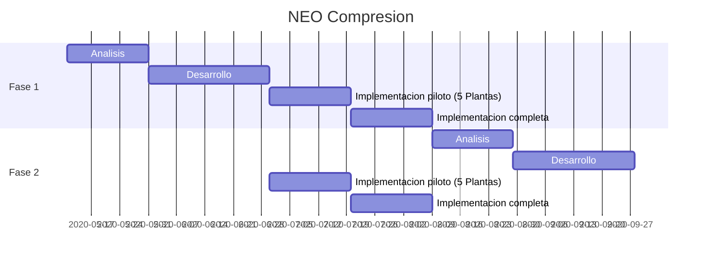

# NEO Compresion (NEO-CP)

NEO
:	Notificacion de Eventos Operativos
## Descripcion de fases del proyecto

- ### Fase 1 - Carga NEO-CP en Rosario (COG-NEO-CP)
	* Carga de parametros comunes a todos los clientes
	* Niveles de Carga y Control: Operador  ->  Supervisor  -> COG.
	* Reportes periodicos basicos

 - ### Fase 2  - Carga NEO-CP en Plantas Compresoras (HMI-NEO-CP)
	* Carga de los partes diarios en el servidor de Telemetria local de cada Planta Compresora
	* Incorporacion de parametros propios de cada Cliente/Contrato
	* Sincronizacion periodica con COG-NEO-CP (NEO Rosario)
	
 - ### Fase 3 - Integracion Telemetria de Planta Compresora (COG-NEO-CP)
	 - Integracion de principales variables con lectura automatica
	 - Reglas de validacion de datos manuales y automaticos
	 - Reportes de causas de carga manual

## Cronograma preliminar de ejecucion del proyecto

<!--stackedit_data:
eyJoaXN0b3J5IjpbNDQ1MjczODI2LC0xODU3MjkzMzcyLDEzMz
k5MjQ0MTldfQ==
-->